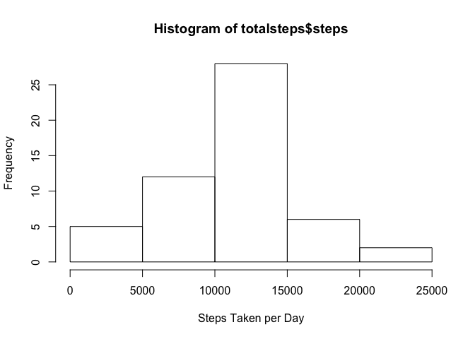
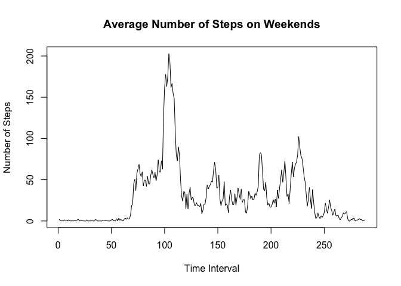
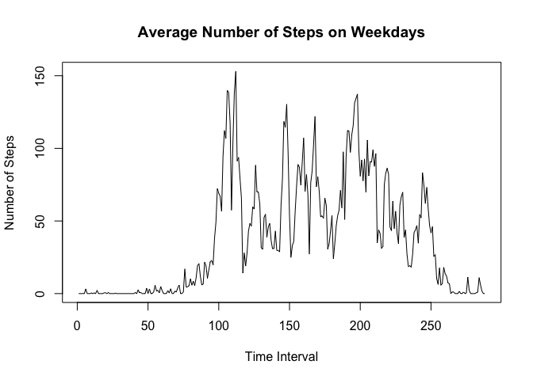

## Loading and preprocessing the data
Load the dataset into R and convert the date into the date class.
Also creates a second dataset without NAs from the original.

```r
data <- read.csv("activity.csv")
data$date <- as.Date(data$date)
dataNa <- data[!is.na(data$steps),]
```

## What is mean total number of steps taken per day?
Calculate the total number of steps taken per day and plots a histogram.

```r
totalsteps <- (data.frame(steps = tapply(dataNa$steps, dataNa$date, sum)))
hist(totalsteps$steps, xlab = "Steps Taken per Day")
```

<!-- -->

Now calculating the mean and median of steps taken per day.

```r
mean(totalsteps$steps)
```

```
## [1] 10766.19
```

```r
median(totalsteps$steps)
```

```
## [1] 10765
```

## What is the average daily activity pattern?
Calculate the average number of steps by the interval time across all days.

```r
intervalsteps <- (data.frame(steps = tapply(dataNa$steps, dataNa$interval, mean)))
plot(intervalsteps, type = "l", ylab = "Average Number of Steps", xlab = "Time of Day (5 min intervals)")
```

<!-- -->

Find which interval has the greatest number of steps taken.

```r
dataNa$interval[match(max(intervalsteps), intervalsteps$steps)]
```

```
## [1] 835
```

## Imputing missing values
Find the total number of NAs in the dataset.

```r
sum(is.na(data$steps))
```

```
## [1] 2304
```

Replace the missing NA values with zero in a new dataframe.

```r
dataNa0 <- data
dataNa0$steps[is.na(dataNa0$steps)] <- 0
```

Create a histogram with the new dataset of the total number of steps taken per day.

```r
totalstepsNa0 <- (data.frame(steps = tapply(dataNa0$steps, dataNa0$date, sum)))
hist(totalstepsNa0$steps, xlab = "Steps Taken per Day")
```

<!-- -->

Find the mean and median of the new dataset.

```r
mean(totalstepsNa0$steps)
```

```
## [1] 9354.23
```

```r
median(totalstepsNa0$steps)
```

```
## [1] 10395
```

Find the difference between the mean and medians of the two different datasets. The values shown below are the difference between NA removed and NA equals 0 in the dataset.

```r
mean(totalsteps$steps) - mean(totalstepsNa0$steps)
```

```
## [1] 1411.959
```

```r
median(totalsteps$steps) - median(totalstepsNa0$steps)
```

```
## [1] 370
```
By replacing NAs with zero instead of removing them altogether, the calculations produce a lower mean and median value.

## Are there differences in activity patterns between weekdays and weekends?
Using the dataset with NAs replaced with zeroes, create a new dataset with a factor column indicating if the day is a weekday or weekend.

```r
dataday <- dataNa0
dataday$Day <- weekdays(dataday$date)
dataday$Day["Sunday" == dataday$Day | "Saturday" == dataday$Day] <- "Weekend"
dataday$Day[!"Weekend" == dataday$Day] <- "Weekday"
```

Calculate the average number of steps by the interval time across all days separated by weekend and weekday.

```r
intervalstepsday <- t(data.frame(steps = tapply(dataday$steps, list(dataday$Day,dataday$interval), mean)))
```

Plot the weekends and weekdays on separate graps.

```r
plot(intervalstepsday[,1], type = "l", main = "Average Number of Steps on Weekends", ylab = "Number of Steps", xlab = "Time Interval")
```

<!-- -->


```r
plot(intervalstepsday[,2], type = "l", main = "Average Number of Steps on Weekdays", ylab = "Number of Steps", xlab = "Time Interval")
```

<!-- -->
